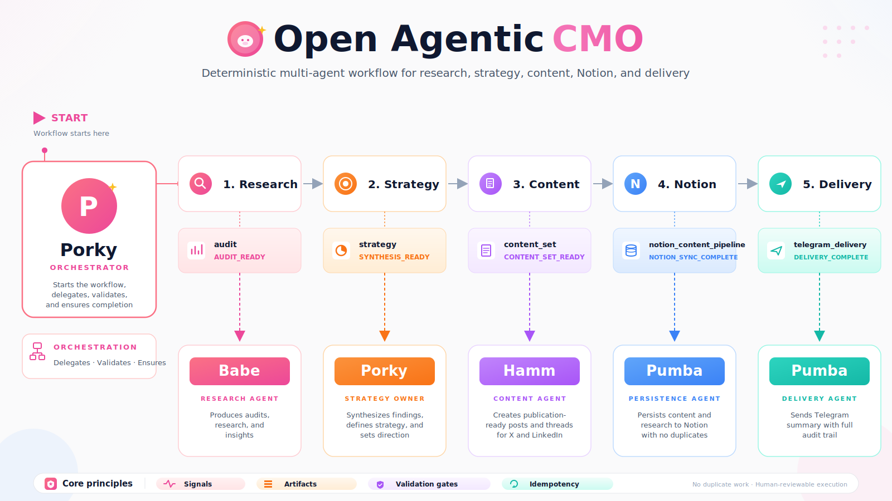

# Open Agentic CMO

An open-source deterministic multi-agent system for running a complete content marketing workflow:

**Research → Strategy → Content → Notion → Delivery**

Originally built for [Piggy Wallet](https://www.piggywallet.app/) — a fintech + edtech product helping families in emerging markets protect savings from inflation and build healthier financial habits. You can also try the [Stellar version](https://stellar.piggywallet.app/).

> **Note:** This repo provides agent contracts, schemas, and setup docs — not a standalone runtime. The workflow runs inside Paperclip.

<p align="center">
  
</p>

---

## Why this exists

Most AI agent workflows fail because they rely on loose text, implicit assumptions, and "looks good" reasoning.

Open Agentic CMO takes a different approach. It is built around:

- **Signals** — explicit workflow transition markers
- **Artifacts** — structured outputs that can be validated
- **Validation gates** — hard checks before moving to the next phase
- **Idempotency** — no duplicate work, no duplicate Notion entries, no duplicate delivery
- **Human reviewability** — both content and research context are persisted for review
- **Failure recovery** — invalid or incomplete states block safely instead of corrupting downstream execution

The goal is not just to generate content. The goal is to build a reliable, auditable, autonomous marketing operating system.

---

## Install

Open Agentic CMO is designed to run in Paperclip using the agent contracts in this repository.

For the full VPS setup, see [docs/10-paperclip-vps-quickstart.md](docs/10-paperclip-vps-quickstart.md).

### 1. Clone the repository

```bash
git clone https://github.com/matiascodela/open-agentic-cmo.git
cd open-agentic-cmo
```

### 2. Create your environment file

```bash
cp .env.example .env
```

### 3. Configure environment variables

Edit `.env` and add your own credentials:

```bash
NOTION_API_KEY=your_notion_api_key_here
NOTION_CONTENT_DATABASE_ID=your_notion_content_database_id_here
NOTION_RESEARCH_DATABASE_ID=your_notion_research_database_id_here

TELEGRAM_BOT_TOKEN=your_telegram_bot_token_here
TELEGRAM_CHAT_ID=your_telegram_chat_id_here
```

Do not commit `.env`. Real credentials should stay local or inside your deployment environment.

### 4. Install Paperclip

Follow the VPS quickstart: [docs/10-paperclip-vps-quickstart.md](docs/10-paperclip-vps-quickstart.md).

The guide covers VPS preparation, Node.js 20+ and pnpm installation, Paperclip installation, SSH tunnel access, workspace setup, and Notion + Telegram setup.

### 5. Add the agent instructions

Create the four core agents in Paperclip and paste the corresponding instruction files:

- `agents/porky/AGENTS.md`
- `agents/babe/AGENTS.md`
- `agents/hamm/AGENTS.md`
- `agents/pumba/AGENTS.md`

Porky also requires supporting operating files: `SOUL.md`, `TOOLS.md`, and `HEARTBEAT.md`.

---

## Quickstart

After completing Install above:

1. Create the four agents in Paperclip and paste their instruction files
2. For Porky, also paste `SOUL.md`, `TOOLS.md`, and `HEARTBEAT.md`
3. Send Porky: *"Run the controlled E2E test for 3 days"*
4. Watch Notion fill with content + Telegram receive a delivery summary

For the full E2E test spec, see [docs/examples/example-controlled-e2e-test.md](docs/examples/example-controlled-e2e-test.md).

---

## Documentation

Core docs:

- [01 — Overview](docs/01-overview.md)
- [02 — Architecture](docs/02-architecture.md)
- [03 — Agent Contracts](docs/03-agent-contracts.md)
- [04 — Signal Contract](docs/04-signal-contract.md)
- [05 — Artifact Contracts](docs/05-artifact-contracts.md)
- [06 — Orchestration Loop](docs/06-orchestration-loop.md)
- [07 — Notion Persistence](docs/07-notion-persistence.md)
- [08 — Testing E2E](docs/08-testing-e2e.md)
- [09 — Failure Recovery](docs/09-failure-recovery.md)
- [10 — Paperclip VPS Quickstart](docs/10-paperclip-vps-quickstart.md)

Examples:

- [Controlled E2E test](docs/examples/example-controlled-e2e-test.md)
- [Audit artifact](docs/examples/example-audit-artifact.md)
- [Strategy artifact](docs/examples/example-strategy-artifact.md)
- [Content set artifact](docs/examples/example-content-set-artifact.md)
- [Signals](docs/examples/example-signals.md)

Schemas live in [`/schemas`](schemas/).

---

## Contributing

Contributions should preserve the system's contract-based design. Before contributing, read [CONTRIBUTING.md](CONTRIBUTING.md), [SECURITY.md](SECURITY.md), and [CODE_OF_CONDUCT.md](CODE_OF_CONDUCT.md).

Good contributions improve clarity, determinism, validation, documentation, examples, schemas, failure recovery, and human reviewability.

---

## Security

Do not commit real API keys, tokens, database IDs, private URLs, workflow logs, or production screenshots. Use `.env.example` for placeholders only.

See [SECURITY.md](SECURITY.md) for details.

---

## License

MIT — see [LICENSE](LICENSE).

Originally built by Piggy Wallet as an internal autonomous content pipeline.
